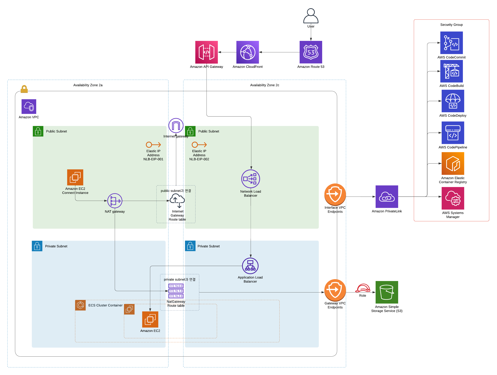

# Terraform-Practice
Terraform Practice Project

## 인프라 설명
- NLB를 사용한 보안성 증가와 부하분산, 속도 증가
- NAT Gateway를 사용한 보안성 증가
- VPC EndPoint를 사용한 비용절감
- ECS EC2 구조의 컨테이너 기반 컴퓨팅 시스템
- Kinessis, Firehorse를 통한 데이터 스트림
- CodeCommit, CodeBuild, CodePipeline을 통한 CI/CD 자동화 구축
- Terraform 을 사용한 아키텍쳐 코드화 (CLI)
